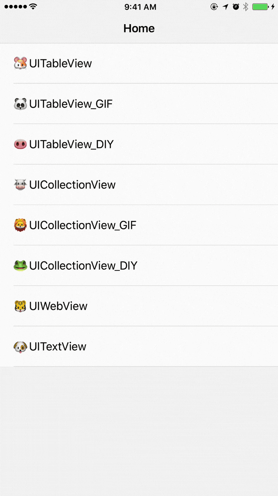
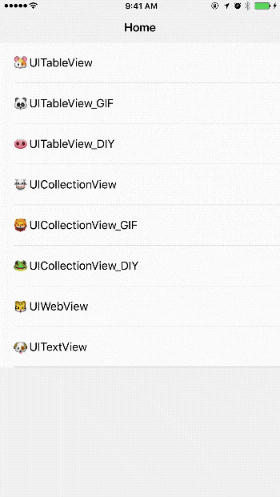
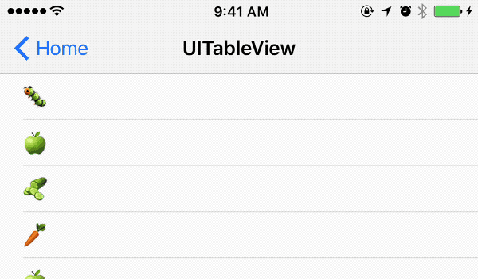
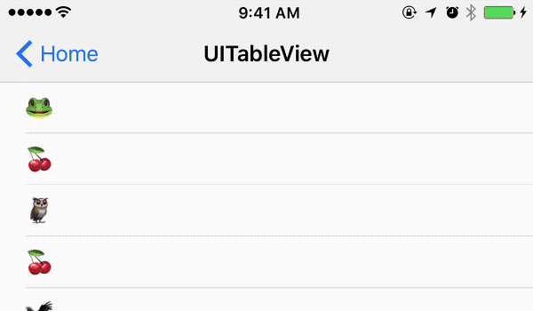
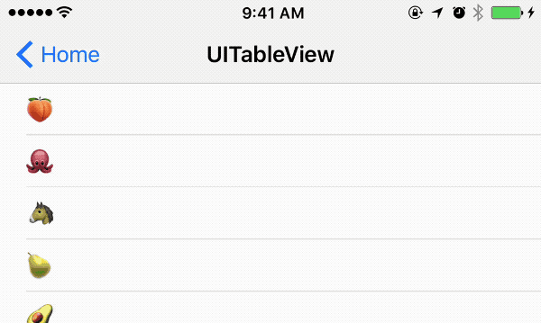
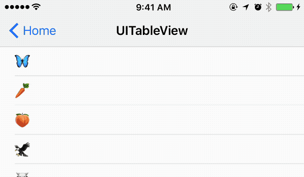
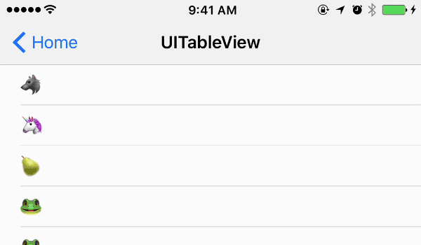
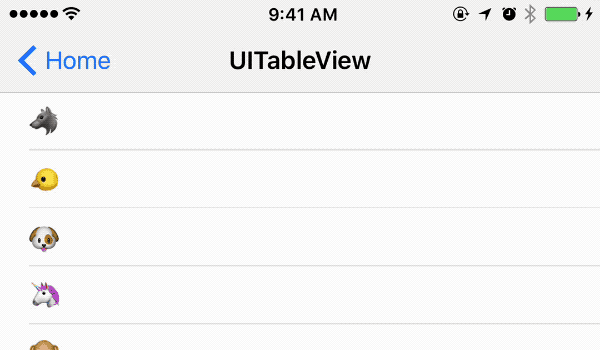
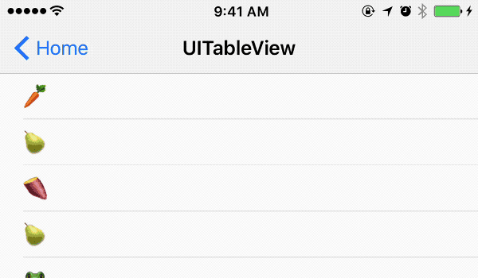

<p align="center">
  
</p>

<p align="center">
<a href="#demo">Demo</a> -
<a href="#installation">Installation</a> -
<a href="#documents">Documents</a> -
<a href="#contribution">Contribution</a>
</p>
    
<p align="center">
<a href="http://cocoadocs.org/docsets/LNRefresh"></a>
<a href="https://github.com/Carthage/Carthage"></a>
<a href="https://developer.apple.com/ios"></a>
<a href="https://github.com/wedxz/LNRefresh/tree/1.0.1"></a>
<a href="https://www.gnu.org/licenses/gpl-3.0"></a>
</p>

# LNRefresh
LNRefresh Is a lightweight, can dynamically expand the drop-down refresh component

#### Support what kinds of controls to refresh
`UIScrollView`、`UITableView`、`UICollectionView`、`UIWebView`、`UITextView`

## Demo
GIF picture from [华尔街见闻](https://wallstreetcn.com/)

| Style   | Demo |
| ---   | --- |
| Usually style |  |
| Dynamically change the style |  |

## Customize Demos
| APP   | Demo |
| ---   | --- |
| 京东 |  |
| 天猫 |  |
| 淘宝 |  |
| 考拉海购 |  |
| 美团外卖 |  |
| 网易新闻 |  |
| 今日头条 |  |
| 飞猪 |  |

## Installation
### CocoaPods
Installation with CocoaPods:

```
pod 'LNRefresh'
```
### Carthage
Installation with Cartfile:

```
github "wedxz/LNRefresh"
```
## Documents
#### How to use LNRefresh
###### Add pull to refresh
```
__weak typeof (self) wself = self;
//UITableView
[self.tableView addPullToRefresh:^{
  [wself pullToRefresh];
}];

//UICollectionView
[self.collectionView addPullToRefresh:^{
  [wself pullToRefresh];
}];

//UIWebView
[self.webView.scrollView addPullToRefresh:^{
   [wself.webView reload];
}];
```
###### End Pull to refresh
```
//UITableView
[self.tableView endRefreshing];

//UICollectionView
[self.collectionView endRefreshing];

//UIWebView
[self.webView.scrollView endRefreshing];
```
###### Add Loading more
```
//UITableView
[self.tableView addInfiniteScrolling:^{
  [wself loadMoreRefresh];
}];

//UICollectionView
[self.collectionView addInfiniteScrolling:^{
  [wself loadMoreRefresh];
}];
```
###### End Loading more
```
//UITableView
[self.tableView endLoadingMore];

//UICollectionView
[self.tableView endLoadingMore];
```
###### No More data
```
//UITableView
[self.tableView noticeNoMoreData];

//UICollectionView
[self.tableView noticeNoMoreData];
```
###### Auto Refresh
```
[self.scrollView startRefreshing];
```
###### Change the trigger to pull the refresh distance
```
self.tableView.ln_header.animator.trigger = 100;
```

#### Global Settings
###### Set the GIF image
```
+ (void)setAllHeaderAnimatorStateImages:(NSArray *)stateImages
                                  state:(LNRefreshState)state;

+ (void)setAllHeaderAnimatorStateImages:(NSArray *)stateImages
                                  state:(LNRefreshState)state
                               duration:(NSTimeInterval)duration;
```
###### Change the global pull-down refresh pattern state
```
+ (void)changeAllHeaderAnimatorType:(LNRefreshHeaderType)type;

+ (void)changeAllHeaderAnimatorType:(LNRefreshHeaderType)type
                            bgImage:(UIImage *)image;

+ (void)changeAllHeaderAnimatorType:(LNRefreshHeaderType)type
                            bgImage:(UIImage *)image
                        incremental:(CGFloat)incremental;
```

#### Customize RefreshAnimator
You Need to inherit LNHeaderAnimator，Rewrite the following method.

```
- (void)setupHeaderView_DIY;
- (void)layoutHeaderView_DIY;
- (void)refreshHeaderView_DIY:(LNRefreshState)state;
- (void)refreshView_DIY:(LNRefreshComponent *)view progress:(CGFloat)progress;
```
Example: `LNHeaderDIYAnimator.m`

#### Analysis
Example: `LNHeaderAnimator+Analysis.m`

## Contribution
[vvusu](https://github.com/wedxz)
## License
<a href="https://www.gnu.org/licenses/gpl-3.0"></a>

Copyright (c) 2017 vvusu 


